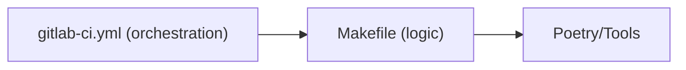
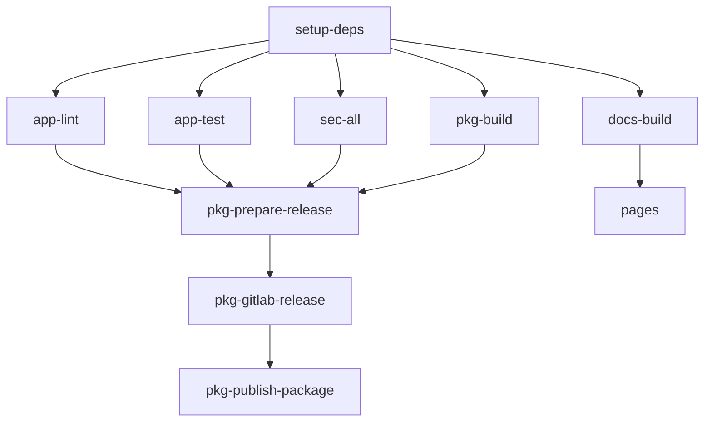
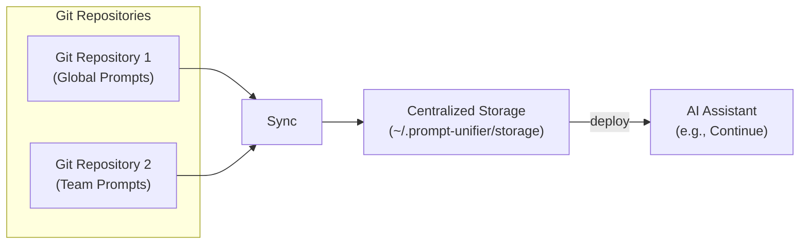

# Development Guide

This document provides technical details for developers working on the `prompt-unifier` codebase.
For guidelines on submitting changes, see [CONTRIBUTING.md](CONTRIBUTING.md).

______________________________________________________________________

## Table of Contents

- [Development Setup](#development-setup)
- [Core Workflow](#core-workflow)
- [Testing](#testing)
- [Code Style and Quality](#code-style-and-quality)
- [CI/CD Pipeline](#cicd-pipeline)
- [Release Process](#release-process)
- [Project Structure](#project-structure)
- [Architecture](#architecture)
- [Logging System](#logging-system)
- [Adding New Tool Handlers](#adding-new-tool-handlers)

______________________________________________________________________

## Development Setup

### Prerequisites

| Requirement | Version | Check Installation |
| ----------- | ------- | ------------------ |
| **Python**  | 3.11+   | `python --version` |
| **Poetry**  | 1.7+    | `poetry --version` |
| **Git**     | 2.x+    | `git --version`    |

### 1. Clone the Repository

```bash
git clone https://gitlab.com/waewoo/prompt-unifier.git
cd prompt-unifier
```

### 2. Install Dependencies

This project uses [Poetry](https://python-poetry.org/) for dependency management. The `Makefile`
provides a convenient way to install everything, including pre-commit hooks.

```bash
# This runs `poetry install` AND installs pre-commit hooks automatically
make env-install
```

______________________________________________________________________

## Core Workflow

All common tasks are managed through the **Makefile**, which serves as the single entry point for
development and CI/CD operations. The Makefile is organized into functional groups:

### Environment Setup

- `make env-install`: Install dependencies and git hooks (first-time setup)
- `make env-update`: Update all dependencies (refreshing lock file)
- `make env-clean`: Cleanup temporary files and caches

### Application Development

- `make app-run ARGS="--version"`: Run the CLI with arguments
- `make app-lint`: Run static analysis (lint, format, types via pre-commit)
- `make app-test`: Run unit tests with coverage
- `make app-check-all`: Run FULL validation (lint + test + CI check) **Run this before every
  commit.**

### CI/CD Simulation

The Makefile includes targets to run the GitLab CI/CD pipeline locally using `gitlab-ci-local`:

- `make ci-pipeline`: Run FULL GitLab pipeline locally in Docker (recommended for accuracy)
- `make ci-job JOB=<name>`: Run specific GitLab CI job locally (e.g., `make ci-job JOB=app-lint`)
- `make ci-validate`: Validate `.gitlab-ci.yml` syntax
- `make ci-list`: List all available CI jobs
- `make ci-clean`: Clean CI volumes and cache

**CI Image Management:**

- `make ci-image-build`: Build custom CI base Docker image (defined in `Dockerfile.ci`)
- `make ci-image-push`: Push CI base image to registry
- `make ci-image-login`: Login to GitLab container registry

### Security Scanning

- `make sec-all`: Run ALL security scans (code + secrets + deps)
- `make sec-code`: SAST scan with Bandit
- `make sec-secrets`: Secret detection with detect-secrets
- `make sec-deps`: Dependency vulnerability check with pip-audit

### Package & Release

- `make pkg-build`: Build wheel/sdist packages
- `make pkg-changelog`: Generate changelog from conventional commits
- `make pkg-publish VERSION_BUMP=<patch|minor|major>`: Create release and push tags

### Documentation

- `make docs-install`: Install documentation dependencies
- `make docs-live PORT=8000`: Serve docs locally with live reload (default port: 8000)
- `make docs-build`: Build static documentation site

Run `make help` to see all available targets with descriptions.

______________________________________________________________________

## Testing

We use `pytest` for testing.

### Running Tests

```bash
# Run all tests and generate a coverage report
make app-test

# Run tests in a specific file
poetry run pytest tests/cli/test_commands.py

# Run tests in a specific directory
poetry run pytest tests/handlers/

# Run tests with verbose output
poetry run pytest -v
```

### Test Coverage

A minimum of **95% test coverage** is required. After running `make app-test`, you can view a
detailed HTML report by opening `htmlcov/index.html` in your browser.

```bash
# For macOS users
open htmlcov/index.html

# For Linux users
xdg-open htmlcov/index.html
```

______________________________________________________________________

## Code Style and Quality

Code quality is enforced automatically by pre-commit hooks and the CI pipeline.

- **Linting & Formatting**: We use [Ruff](https://github.com/astral-sh/ruff) for fast linting and
  formatting. Configuration is in `pyproject.toml`.
- **Type Checking**: We use [mypy](http://mypy-lang.org/) in `strict` mode for static type analysis.

You can run these checks manually at any time:

```bash
make app-lint  # Runs pre-commit (includes ruff, mypy, etc.)
```

______________________________________________________________________

## CI/CD Pipeline

The project uses a **Makefile-driven GitLab CI/CD architecture** following BP2I best practices. The
pipeline is defined in `.gitlab-ci.yml` and delegates all logic to Makefile targets.

### Architecture Overview



**Key Benefits:**

- Single entry point for local and CI environments
- Consistent behavior between local dev and CI
- Easy to debug and test locally before pushing

### Pipeline Stages

The GitLab CI pipeline is organized into 5 stages:

1. **setup**: Install dependencies (`setup-deps` job)

   - Creates cache and artifacts for downstream jobs
   - Uses `make env-install`

1. **quality**: Code quality checks (runs in parallel)

   - `app-lint`: Linting, formatting, type checking via `make app-lint`
   - `app-test`: Unit tests with coverage via `make app-test`
   - `app-sonar`: SonarQube code analysis (optional)

1. **security**: Security scanning (runs in parallel with quality)

   - `sec-all`: SAST, secrets, dependencies via `make sec-all`

1. **build**: Package and documentation (runs in parallel after setup)

   - `pkg-build`: Build Python wheel/sdist via `make pkg-build`
   - `docs-build`: Build MkDocs site via `make docs-build`

1. **release**: Release automation and deployment

   - `pkg-prepare-release`: Auto-bump version on `main` branch
   - `pages`: Deploy documentation to GitLab Pages (on `main`)
   - `pkg-gitlab-release`: Create GitLab release on tags
   - `pkg-publish-package`: Upload to PyPI on tags

### Custom CI Image

The pipeline uses a custom Docker image (`Dockerfile.ci`) with pre-installed tools:

- Python 3.12
- Poetry 2.2.1
- Pre-commit, Bandit, detect-secrets, pip-audit, pytest

Build and push the image:

```bash
make ci-image-build
make ci-image-push
```

### Local CI Testing

You can run the **exact** GitLab CI pipeline locally using `gitlab-ci-local`:

**Prerequisites:**

- Docker installed and running
- Node.js and npm: `npm install -g gitlab-ci-local`

**Makefile Commands:**

```bash
# Run FULL pipeline locally (recommended for pre-push validation)
make ci-pipeline

# Run specific job (e.g., just linting)
make ci-job JOB=app-lint

# List all available jobs
make ci-list

# Validate .gitlab-ci.yml syntax
make ci-validate

# Clean CI volumes and cache
make ci-clean
```

**Cache Strategy:**

- **Cache**: Poetry venv persists across pipelines (keyed by `poetry.lock`)
- **Artifacts**: `.venv/` shared within current pipeline run (1 hour expiry)
- **Fallback**: Jobs have `before_script` to install deps if cache misses

### DAG Optimization

The pipeline uses GitLab's `needs` keyword for parallel execution:



Quality, security, and build stages run **in parallel** immediately after dependencies are ready.

### Pipeline Workflows & Triggers

To optimize resources and ensure stability, the pipeline behaves differently depending on the
context (branch, event, tag).

#### 1. Feature Branch (Push without MR)

*You are coding on `feat/my-feature` but haven't opened a Merge Request yet.*

- **Launched:** 🚫 Nothing.
- **Why?** We save CI minutes while you are drafting. The pipeline only triggers when you are ready
  to merge.

#### 2. Merge Request (Code Review)

*You open a MR from `feat/my-feature` to `main`.*

- **Goal:** Validate quality, security, and build integrity.
- **Jobs Launched:**
  - ✅ `setup-deps`: Prepare environment
  - ✅ `app-lint`, `app-test`, `app-sonar`
  - ✅ `sec-all`: Security scans
  - ✅ `pkg-build`: Build package artifacts
  - ✅ `docs-build`: Build documentation site
- **Skipped:** `release` stage (No deployment).

#### 3. Main Branch (After Merge)

*Your MR is merged into `main`.*

- **Goal:** Create release candidate and deploy documentation.
- **Jobs Launched:**
  - ✅ `setup-deps`
  - ✅ `app-lint`, `app-test`, `sec-all`
  - ✅ `docs-build`: Automatic build of documentation.
  - ✅ `pages`: Automatic deployment of documentation (if `docs-build` passes).
- **Manual Gates:**
  - ⏸️ `pkg-build`: Must be triggered manually to build the package and proceed to release.
- **On Success (after manual trigger):**
  - ✅ `pkg-prepare-release`: Creates new version tag (if `pkg-build` passes).

#### 4. Tag (Release, e.g., `v1.0.0`)

*A tag is pushed (manually or via `pkg-prepare-release`).*

- **Goal:** Delivery.
- **Jobs Launched:**
  - ✅ `setup-deps`
  - ✅ `pkg-build` (Auto-run)
  - ✅ `pkg-gitlab-release` (Create GitLab Release)
  - ✅ `pkg-publish-package` (Publish to PyPI)
- **Skipped:** Quality & Security checks (already passed on `main`), `docs-build`, `pages`,
  `pkg-prepare-release`.

#### Summary Table

| Job / Stage          | Feature (No MR) | Merge Request |  Main (Merge)   | Tag (Release) |
| :------------------- | :-------------: | :-----------: | :-------------: | :-----------: |
| **Setup**            |       ⬜        |      ✅       |       ✅        |      ✅       |
| **Quality**          |       ⬜        |      ✅       |       ✅        |      ❌       |
| **Security**         |       ⬜        |      ✅       |       ✅        |      ❌       |
| **Build Package**    |       ⬜        |      ✅       |   ⏸️ (Manual)   |      ✅       |
| **Build Doc**        |       ⬜        |      ✅       |       ✅        |      ❌       |
| **Bump Version**     |       ⬜        |      ❌       | ✅ (After gate) |      ❌       |
| **Upload / Release** |       ⬜        |      ❌       |       ❌        |      ✅       |
| **Deploy Pages**     |       ⬜        |      ❌       |       ✅        |      ❌       |

______________________________________________________________________

## Release Process

Releases are managed using `commitizen` and are automated via the `Makefile` and GitLab CI.

### Manual Local Release

To create a new release from your local machine:

1. Ensure you are on the `main` branch and all changes are committed.
1. Run the `make pkg-publish` command with the type of version bump.

```bash
# Create a patch release (e.g., 0.4.0 -> 0.4.1)
make pkg-publish VERSION_BUMP=patch

# Create a minor release (e.g., 0.4.1 -> 0.5.0)
make pkg-publish VERSION_BUMP=minor

# Create a major release (e.g., 0.5.0 -> 1.0.0)
make pkg-publish VERSION_BUMP=major
```

This will:

1. Bump the version in `pyproject.toml`
1. Create a git commit
1. Create a git tag (e.g., `v0.4.1`)
1. Push to GitLab (commit + tag)

### Automated CI Release

The GitLab CI pipeline includes automated release jobs:

1. **Version Bump** (`pkg-prepare-release`):

   - Manual job on `main` branch
   - Uses commitizen to analyze commits and auto-bump version
   - Creates tag and pushes to GitLab

1. **GitLab Release** (`pkg-gitlab-release`):

   - Triggered automatically on version tags (e.g., `v2.1.0`)
   - Creates GitLab release with changelog

1. **PyPI Upload** (`pkg-publish-package`):

   - Triggered automatically on version tags
   - Publishes package to PyPI
   - Requires `PYPI_USER` and `PYPI_PASSWORD` CI variables

______________________________________________________________________

## Project Structure

```
prompt-unifier/
├── src/prompt_unifier/   # Main source code
│   ├── cli/              # CLI commands (Typer)
│   ├── config/           # Configuration management
│   ├── core/             # Core logic (validation, parsing)
│   ├── git/              # Git integration services
│   ├── handlers/         # Handlers for AI tools (Continue, etc.)
│   ├── models/           # Pydantic data models
│   └── output/           # Output formatters (Rich, JSON)
├── tests/                # Test suite
│   ├── cli/
│   ├── core/
│   ├── integration/      # End-to-end tests
│   └── fixtures/         # Test data and fixtures
├── .gitlab-ci.yml        # GitLab CI/CD pipeline configuration
├── Makefile              # Makefile with development commands
├── pyproject.toml        # Project metadata and dependencies
└── README.md             # User-facing documentation
```

## Architecture

The data flows from your Git repositories to a central storage location on your machine, and then is
deployed to the AI tools in your project.



______________________________________________________________________

## Logging System

The project uses a centralized logging system based on Python's built-in `logging` module with Rich
integration for colored terminal output.

### Configuration

Logging is configured globally via CLI flags:

```bash
# Default: WARNING level only
prompt-unifier validate

# INFO level (-v)
prompt-unifier -v sync --repo https://example.com/repo.git

# DEBUG level (-vv)
prompt-unifier -vv deploy --handlers continue

# With file logging
prompt-unifier -vv --log-file debug.log validate
```

### Using Logging in Code

When adding logging to a module, follow this pattern:

```python
import logging

logger = logging.getLogger(__name__)

def my_function():
    logger.debug("Detailed tracing info")  # -vv
    logger.info("Progress information")     # -v
    logger.warning("Important warnings")    # default
    logger.error("Error messages")          # always shown
```

### Log Levels

| Level   | Verbosity | Use Case                                      |
| ------- | --------- | --------------------------------------------- |
| WARNING | Default   | Important issues, deprecations                |
| INFO    | `-v`      | Progress info, file counts, operation status  |
| DEBUG   | `-vv`     | Detailed tracing, variable values, full paths |

### Implementation Details

- **Console output**: Uses `rich.logging.RichHandler` writing to stderr (keeps stdout clean for
  JSON/piping)
- **File output**: Plain text format with timestamps for parsing
- **Module**: `src/prompt_unifier/utils/logging_config.py`

### Adding Logging to New Modules

1. Import logging and create a logger:

   ```python
   import logging
   logger = logging.getLogger(__name__)
   ```

1. Use appropriate log levels:

   - `logger.debug()` for detailed tracing
   - `logger.info()` for progress/status
   - `logger.warning()` for issues that don't stop execution
   - `logger.error()` for errors (usually followed by exception handling)

______________________________________________________________________

## Adding New Tool Handlers

This section provides a comprehensive guide for adding support for new AI tools to `prompt-unifier`.
By following this tutorial, you'll learn how to create a handler that deploys prompts and rules to
your target tool.

### Overview: The Handler Architecture

`prompt-unifier` uses the **Strategy Pattern with Template Method** to support multiple AI tools.
Each tool (Continue, Cursor, Windsurf, etc.) has its own "handler" - a class that knows how to
deploy prompts and rules to that specific tool's expected locations and formats.

The architecture consists of four main components:

1. **ToolHandler Protocol**: Defines the interface that all handlers must implement
1. **BaseToolHandler**: Abstract base class providing common functionality (backup, rollback,
   verification, etc.)
1. **Concrete Handlers**: Tool-specific implementations (e.g., `ContinueToolHandler`,
   `KiloCodeToolHandler`) that inherit from `BaseToolHandler`
1. **ToolHandlerRegistry**: Manages handler registration and retrieval

This design allows you to add support for new tools without modifying existing code or duplicating
common logic - you simply create a new handler class that inherits from `BaseToolHandler`, implement
tool-specific methods, and register it.

#### Existing Handlers

The project currently includes two fully-implemented handlers that serve as excellent reference
implementations:

- **`ContinueToolHandler`** (`src/prompt_unifier/handlers/continue_handler.py`): Deploys to Continue
  AI assistant with YAML frontmatter preservation
- **`KiloCodeToolHandler`** (`src/prompt_unifier/handlers/kilo_code_handler.py`): Deploys to Kilo
  Code with pure Markdown conversion (no YAML frontmatter) and flat directory structure with
  directory-prefixed file naming

When creating a new handler, refer to these implementations for best practices and patterns. Both
handlers inherit from `BaseToolHandler` and only implement tool-specific logic, demonstrating the
power of the base class architecture.

#### Benefits of BaseToolHandler

The `BaseToolHandler` abstract base class (`src/prompt_unifier/handlers/base_handler.py`) provides:

- ✅ **Automatic backup/rollback** mechanisms
- ✅ **Common verification** methods and reporting
- ✅ **Status checking** methods (`get_name()`, `get_status()`)
- ✅ **File cleanup** for orphaned files
- ✅ **Directory management** utilities
- ✅ **Consistent error handling** patterns

This means you only need to implement **tool-specific** logic (content transformation, deployment
paths) while inheriting all common functionality.

### Understanding BaseToolHandler

The `BaseToolHandler` abstract base class (defined in `src/prompt_unifier/handlers/base_handler.py`)
provides all common functionality that handlers need. When you inherit from it, you get these
methods automatically:

#### Methods Inherited Automatically

You **don't need to implement** these methods - they're already provided by `BaseToolHandler`:

| Method                                     | Purpose                                                     |
| ------------------------------------------ | ----------------------------------------------------------- |
| `get_name()`                               | Returns the handler's unique identifier                     |
| `get_status()`                             | Returns "active" if directories exist, "inactive" otherwise |
| `_backup_file(file_path)`                  | Creates `.bak` backup of existing files                     |
| `validate_tool_installation()`             | Validates directories exist and are writable                |
| `rollback()`                               | Restores all `.bak` files after failed deployment           |
| `clean_orphaned_files(deployed_filenames)` | Removes files not in deployment set                         |
| `_remove_empty_directories(base_dir)`      | Cleans up empty subdirectories                              |
| `aggregate_verification_results(results)`  | Aggregates verification counts                              |
| `display_verification_report(results)`     | Shows formatted Rich table with results                     |
| `_compare_content_hashes(source, target)`  | Compares SHA-256 hashes for sync status                     |

#### Methods You Must Implement

Your handler **must implement** these tool-specific methods:

| Method                                     | Purpose                                          | Example                                                                                           |
| ------------------------------------------ | ------------------------------------------------ | ------------------------------------------------------------------------------------------------- |
| `__init__(base_path)`                      | Set up directories and call `super().__init__()` | Set `self.name`, `self.base_path`, `self.prompts_dir`, `self.rules_dir`, `self.tool_dir_constant` |
| `deploy(content, content_type, body, ...)` | Deploy content to tool's directory structure     | Transform content, write to correct path                                                          |
| `verify_deployment_with_details(...)`      | Verify deployment with tool-specific checks      | Check frontmatter format, required fields                                                         |
| `get_deployment_status(...)`               | Check if content is synced/outdated/missing      | Use `_compare_content_hashes()` from base class                                                   |

#### Shared Utilities in Base Handler

`base_handler.py` also provides:

- **`VerificationResult` dataclass**: For storing verification details
- **Color constants**: `ERROR_COLOR`, `WARNING_COLOR`, `SUCCESS_COLOR`

Import these as needed:

```python
from prompt_unifier.handlers.base_handler import BaseToolHandler, VerificationResult
```

#### Shared Console

The shared console instance is in `handler_utils.py`:

```python
from prompt_unifier.handlers.handler_utils import console
```

Use it for all output in your handler.

______________________________________________________________________

### Tutorial: Creating a New Handler

Let's create a complete handler for a hypothetical "ExampleAI" tool. This demonstrates the minimal
code needed with `BaseToolHandler`.

#### Step 1: Create the Handler File

Create `src/prompt_unifier/handlers/example_handler.py`:

```python
"""Handler for ExampleAI tool deployment."""

import logging
from pathlib import Path
from typing import Any

import yaml

from prompt_unifier.constants import EXAMPLE_AI_DIR  # Add to constants.py: EXAMPLE_AI_DIR = ".example-ai"
from prompt_unifier.handlers.base_handler import BaseToolHandler, VerificationResult
from prompt_unifier.handlers.handler_utils import console
from prompt_unifier.models.prompt import PromptFrontmatter
from prompt_unifier.models.rule import RuleFrontmatter

logger = logging.getLogger(__name__)


class ExampleToolHandler(BaseToolHandler):
    """
    Tool handler for ExampleAI assistant.

    Deploys prompts and rules to the .example-ai directory structure:
    - .example-ai/prompts/  - For prompt files
    - .example-ai/rules/    - For rule files
    """

    def __init__(self, base_path: Path | None = None):
        """
        Initialize the ExampleAI handler.

        Args:
            base_path: Base directory for deployment. Defaults to Path.cwd().
        """
        # REQUIRED: Call parent __init__
        super().__init__()

        # REQUIRED: Set these attributes for BaseToolHandler
        self.name = "example"
        self.base_path = base_path if base_path else Path.cwd()
        self.tool_dir_constant = EXAMPLE_AI_DIR
        self.prompts_dir = self.base_path / EXAMPLE_AI_DIR / "prompts"
        self.rules_dir = self.base_path / EXAMPLE_AI_DIR / "rules"

        # Auto-create directories
        if not self.prompts_dir.exists():
            self.prompts_dir.mkdir(parents=True, exist_ok=True)
            console.print(f"[cyan]Created ExampleAI prompts directory: {self.prompts_dir}[/cyan]")

        if not self.rules_dir.exists():
            self.rules_dir.mkdir(parents=True, exist_ok=True)
            console.print(f"[cyan]Created ExampleAI rules directory: {self.rules_dir}[/cyan]")

    # =========================================================================
    # Tool-Specific Content Processing
    # =========================================================================

    def _process_prompt_content(self, prompt: PromptFrontmatter, body: str) -> str:
        """
        Transform universal frontmatter to ExampleAI's expected format.

        Args:
            prompt: Universal prompt frontmatter
            body: Markdown content body

        Returns:
            Formatted content for ExampleAI
        """
        # Map to ExampleAI's schema
        example_frontmatter: dict[str, Any] = {
            "name": prompt.title,
            "description": prompt.description,
            "enabled": True,  # ExampleAI-specific field
        }

        # Add optional fields
        if prompt.category:
            example_frontmatter["category"] = prompt.category
        if prompt.tags:
            example_frontmatter["tags"] = prompt.tags
        if prompt.author:
            example_frontmatter["author"] = prompt.author

        frontmatter_str = yaml.safe_dump(example_frontmatter, sort_keys=False)
        return f"---\n{frontmatter_str.rstrip()}\n---\n{body}"

    def _process_rule_content(self, rule: RuleFrontmatter, body: str) -> str:
        """
        Transform universal rule frontmatter to ExampleAI's expected format.

        Args:
            rule: Universal rule frontmatter
            body: Markdown content body

        Returns:
            Formatted content for ExampleAI
        """
        example_frontmatter: dict[str, Any] = {
            "name": rule.title,
            "autoApply": False,  # ExampleAI-specific: rules disabled by default
        }

        if rule.description:
            example_frontmatter["description"] = rule.description
        if rule.applies_to:
            # ExampleAI uses "patterns" instead of "applies_to"
            example_frontmatter["patterns"] = rule.applies_to
        if rule.category:
            example_frontmatter["category"] = rule.category
        if rule.tags:
            example_frontmatter["tags"] = rule.tags

        frontmatter_str = yaml.safe_dump(example_frontmatter, sort_keys=False)
        return f"---\n{frontmatter_str.rstrip()}\n---\n{body}"

    # =========================================================================
    # REQUIRED: Deployment Method
    # =========================================================================

    def deploy(
        self,
        content: Any,
        content_type: str,
        body: str = "",
        source_filename: str | None = None,
        relative_path: Path | None = None,
    ) -> None:
        """
        Deploy a prompt or rule to ExampleAI directories.

        Args:
            content: PromptFrontmatter or RuleFrontmatter object
            content_type: "prompt" or "rule"
            body: Markdown content body
            source_filename: Original filename to preserve (optional)
            relative_path: Subdirectory structure to preserve (optional)
        """
        # Determine target filename
        if source_filename:
            filename = source_filename if source_filename.endswith(".md") else f"{source_filename}.md"
        else:
            filename = f"{content.title}.md"

        # Process content based on type
        if content_type == "prompt":
            if not isinstance(content, PromptFrontmatter):
                raise ValueError("Content must be PromptFrontmatter for type 'prompt'")
            processed_content = self._process_prompt_content(content, body)
            base_dir = self.prompts_dir
        elif content_type == "rule":
            if not isinstance(content, RuleFrontmatter):
                raise ValueError("Content must be RuleFrontmatter for type 'rule'")
            processed_content = self._process_rule_content(content, body)
            base_dir = self.rules_dir
        else:
            raise ValueError(f"Unsupported content type: {content_type}")

        # Handle subdirectory structure
        if relative_path and str(relative_path) != ".":
            target_dir = base_dir / relative_path
            target_dir.mkdir(parents=True, exist_ok=True)
            target_file_path = target_dir / filename
        else:
            target_file_path = base_dir / filename

        # Use inherited backup method, then write
        self._backup_file(target_file_path)
        target_file_path.write_text(processed_content, encoding="utf-8")

        console.print(
            f"[green]Deployed {content.title} ({content_type}) to {target_file_path}[/green]"
        )

    # =========================================================================
    # REQUIRED: Deployment Status Check
    # =========================================================================

    def get_deployment_status(
        self,
        content_name: str,
        content_type: str,
        source_content: str,
        source_filename: str | None = None,
        relative_path: Path | None = None,
    ) -> str:
        """
        Check deployment status using SHA-256 hash comparison.

        Args:
            content_name: Content name/title
            content_type: "prompt" or "rule"
            source_content: Expected processed content
            source_filename: Optional specific filename
            relative_path: Optional subdirectory path

        Returns:
            "synced", "outdated", "missing", or "error"
        """
        # Determine filename
        if source_filename:
            filename = source_filename if source_filename.endswith(".md") else f"{source_filename}.md"
        else:
            filename = f"{content_name}.md"

        # Determine directory
        if content_type == "prompt":
            base_dir = self.prompts_dir
        elif content_type == "rule":
            base_dir = self.rules_dir
        else:
            return "error"

        # Build path
        if relative_path and str(relative_path) != ".":
            target_file = base_dir / relative_path / filename
        else:
            target_file = base_dir / filename

        # Check existence
        if not target_file.exists():
            return "missing"

        # Use inherited hash comparison method
        return self._compare_content_hashes(source_content, target_file)

    # =========================================================================
    # REQUIRED: Detailed Verification
    # =========================================================================

    def verify_deployment_with_details(
        self,
        content_name: str,
        content_type: str,
        file_name: str,
        relative_path: Path | None = None,
    ) -> VerificationResult:
        """
        Verify deployment with tool-specific validation.

        Args:
            content_name: Content name/title
            content_type: "prompt" or "rule"
            file_name: Filename of deployed file
            relative_path: Optional subdirectory path

        Returns:
            VerificationResult with status and details
        """
        actual_file_name = file_name if file_name.endswith(".md") else f"{file_name}.md"

        # Determine directory
        if content_type == "prompt":
            base_dir = self.prompts_dir
        elif content_type == "rule":
            base_dir = self.rules_dir
        else:
            return VerificationResult(
                file_name=file_name,
                content_type=content_type,
                status="failed",
                details=f"Unsupported content type: {content_type}",
            )

        # Build path
        if relative_path and str(relative_path) != ".":
            target_file_path = base_dir / relative_path / actual_file_name
        else:
            target_file_path = base_dir / actual_file_name

        # Check file exists
        if not target_file_path.exists():
            return VerificationResult(
                file_name=file_name,
                content_type=content_type,
                status="failed",
                details=f"File does not exist: {target_file_path}",
            )

        # Read content
        try:
            deployed_content = target_file_path.read_text(encoding="utf-8")
        except (OSError, UnicodeDecodeError) as e:
            return VerificationResult(
                file_name=file_name,
                content_type=content_type,
                status="failed",
                details=f"Cannot read file: {e}",
            )

        # ExampleAI-specific validation for prompts
        if content_type == "prompt":
            parts = deployed_content.split("---", 2)
            if len(parts) < 3:
                return VerificationResult(
                    file_name=file_name,
                    content_type=content_type,
                    status="failed",
                    details="Invalid format: missing frontmatter delimiters",
                )

            frontmatter_str = parts[1].strip()
            try:
                frontmatter = yaml.safe_load(frontmatter_str)
                if not isinstance(frontmatter, dict):
                    return VerificationResult(
                        file_name=file_name,
                        content_type=content_type,
                        status="failed",
                        details="Invalid frontmatter: not a dictionary",
                    )

                # Check ExampleAI-specific required field
                if not frontmatter.get("enabled"):
                    return VerificationResult(
                        file_name=file_name,
                        content_type=content_type,
                        status="failed",
                        details="Missing or false 'enabled' field",
                    )
            except yaml.YAMLError as e:
                return VerificationResult(
                    file_name=file_name,
                    content_type=content_type,
                    status="failed",
                    details=f"Invalid YAML: {e}",
                )

        return VerificationResult(
            file_name=file_name,
            content_type=content_type,
            status="passed",
            details="File verified successfully",
        )
```

**Key Points:**

- ✅ Only **~250 lines** vs **~450 lines** without `BaseToolHandler`
- ✅ No backup/rollback logic - inherited from base class
- ✅ No verification reporting - inherited from base class
- ✅ No status methods - inherited from base class
- ✅ Focus **only** on tool-specific transformation logic

______________________________________________________________________

### Testing Your Handler

Follow TDD - write tests first, then ensure they pass.

#### Create Test File

Create `tests/handlers/test_example_handler.py`:

```python
"""Tests for ExampleToolHandler."""

import shutil
from pathlib import Path

import pytest

from prompt_unifier.handlers.example_handler import ExampleToolHandler
from prompt_unifier.models.prompt import PromptFrontmatter
from prompt_unifier.models.rule import RuleFrontmatter


@pytest.fixture
def mock_base_dir(tmp_path: Path) -> Path:
    """Create temporary base directory."""
    return tmp_path / "test_base"


@pytest.fixture
def example_handler(mock_base_dir: Path) -> ExampleToolHandler:
    """Create handler instance."""
    return ExampleToolHandler(base_path=mock_base_dir)


@pytest.fixture
def mock_prompt() -> PromptFrontmatter:
    """Create mock prompt."""
    return PromptFrontmatter(
        title="Test Prompt",
        description="A test prompt",
    )


class TestExampleToolHandlerInit:
    """Test initialization."""

    def test_init_creates_directories(self, example_handler: ExampleToolHandler):
        """Test directory creation."""
        assert example_handler.prompts_dir.exists()
        assert example_handler.rules_dir.exists()

    def test_get_name(self, example_handler: ExampleToolHandler):
        """Test get_name (inherited from BaseToolHandler)."""
        assert example_handler.get_name() == "example"

    def test_get_status_active(self, example_handler: ExampleToolHandler):
        """Test get_status (inherited from BaseToolHandler)."""
        assert example_handler.get_status() == "active"

    def test_get_status_inactive(self, example_handler: ExampleToolHandler):
        """Test inactive status when directories missing."""
        shutil.rmtree(example_handler.prompts_dir)
        assert example_handler.get_status() == "inactive"


class TestExampleToolHandlerDeploy:
    """Test deployment."""

    def test_deploy_prompt_creates_file(
        self, example_handler: ExampleToolHandler, mock_prompt: PromptFrontmatter
    ):
        """Test prompt deployment."""
        example_handler.deploy(mock_prompt, "prompt", "Test body")

        target_file = example_handler.prompts_dir / f"{mock_prompt.title}.md"
        assert target_file.exists()

        content = target_file.read_text()
        assert "name: Test Prompt" in content
        assert "enabled: true" in content
        assert "Test body" in content

    def test_deploy_creates_backup(
        self, example_handler: ExampleToolHandler, mock_prompt: PromptFrontmatter
    ):
        """Test backup creation (inherited from BaseToolHandler)."""
        target_file = example_handler.prompts_dir / f"{mock_prompt.title}.md"
        target_file.write_text("original")

        example_handler.deploy(mock_prompt, "prompt", "new")

        backup_file = target_file.with_suffix(".md.bak")
        assert backup_file.exists()
        assert backup_file.read_text() == "original"


class TestExampleToolHandlerRollback:
    """Test rollback (inherited from BaseToolHandler)."""

    def test_rollback_restores_backups(self, example_handler: ExampleToolHandler):
        """Test rollback functionality."""
        backup_file = example_handler.prompts_dir / "test.md.bak"
        backup_file.write_text("backup content")

        current_file = example_handler.prompts_dir / "test.md"
        current_file.write_text("current")

        example_handler.rollback()

        assert current_file.read_text() == "backup content"
        assert not backup_file.exists()


class TestExampleToolHandlerCleanOrphanedFiles:
    """Test cleanup (inherited from BaseToolHandler)."""

    def test_clean_removes_orphaned_files(self, example_handler: ExampleToolHandler):
        """Test orphaned file removal."""
        orphan = example_handler.prompts_dir / "orphan.md"
        orphan.write_text("orphan")

        removed = example_handler.clean_orphaned_files(set())

        assert removed == 1
        assert not orphan.exists()
```

#### Run Tests

```bash
# Run handler tests
poetry run pytest tests/handlers/test_example_handler.py -v

# With coverage
poetry run pytest tests/handlers/test_example_handler.py \
    --cov=prompt_unifier.handlers.example_handler
```

______________________________________________________________________

### CLI Integration

Register your handler in the `deploy` command.

#### Step 1: Add Constant

Add to `src/prompt_unifier/constants.py`:

```python
EXAMPLE_AI_DIR = ".example-ai"
```

#### Step 2: Import Handler

In `src/prompt_unifier/cli/commands.py`:

```python
from prompt_unifier.handlers.example_handler import ExampleToolHandler
```

#### Step 3: Register Handler

In the `deploy()` function (around line 1100):

```python
# Resolve base paths
example_base_path = resolve_handler_base_path("example")

# Instantiate and validate
if example_base_path is not None:
    example_handler = ExampleToolHandler(base_path=example_base_path)
else:
    example_handler = ExampleToolHandler()

try:
    example_handler.validate_tool_installation()
except (PermissionError, OSError) as e:
    console.print("[red]Failed to validate ExampleAI installation[/red]")
    console.print(f"[red]{e}[/red]")
    raise typer.Exit(code=1) from e

registry.register(example_handler)
```

#### Step 4: Export Handler

In `src/prompt_unifier/handlers/__init__.py`:

```python
from prompt_unifier.handlers.example_handler import ExampleToolHandler

__all__ = [
    "ContinueToolHandler",
    "ExampleToolHandler",  # Add this
    "KiloCodeToolHandler",
    "ToolHandler",
    "ToolHandlerRegistry",
]
```

______________________________________________________________________

### File Structure Checklist

When adding a handler:

- [ ] `src/prompt_unifier/handlers/<tool>_handler.py` - Handler implementation
- [ ] `tests/handlers/test_<tool>_handler.py` - Test suite (95%+ coverage)
- [ ] `src/prompt_unifier/constants.py` - Add tool directory constant
- [ ] `src/prompt_unifier/handlers/__init__.py` - Export handler
- [ ] `src/prompt_unifier/cli/commands.py` - Register in deploy command

______________________________________________________________________

### Naming Conventions

| Item               | Pattern                  | Example                  |
| ------------------ | ------------------------ | ------------------------ |
| Handler class      | `<Tool>ToolHandler`      | `CursorToolHandler`      |
| Handler file       | `<tool>_handler.py`      | `cursor_handler.py`      |
| Test file          | `test_<tool>_handler.py` | `test_cursor_handler.py` |
| Handler name       | `<tool>` (lowercase)     | `"cursor"`               |
| Directory constant | `<TOOL>_DIR`             | `CURSOR_DIR = ".cursor"` |

______________________________________________________________________

### Best Practices

1. **Always inherit from `BaseToolHandler`** - Don't duplicate common logic
1. **Call `super().__init__()`** in your `__init__` method
1. **Set required attributes**: `self.name`, `self.base_path`, `self.tool_dir_constant`,
   `self.prompts_dir`, `self.rules_dir`
1. **Use inherited methods**: `self._backup_file()`, `self._compare_content_hashes()`, etc.
1. **Import from the right places**:
   - `from prompt_unifier.handlers.base_handler import BaseToolHandler, VerificationResult`
   - `from prompt_unifier.handlers.handler_utils import console`
1. **Test inherited functionality** - Verify base class methods work correctly
1. **Focus on tool-specific logic** - Content transformation, validation rules
1. **Write comprehensive tests** - Aim for 95%+ coverage

______________________________________________________________________

### Troubleshooting

**Handler not showing up:**

- Check it's registered in `commands.py`
- Verify `get_name()` returns correct identifier
- Ensure exported in `__init__.py`

**Base class methods not working:**

- Did you call `super().__init__()`?
- Are required attributes set correctly?

**Tests failing:**

- Use `tmp_path` fixture for isolation
- Test both tool-specific AND inherited methods
- Check path separators on different OSes

______________________________________________________________________

### Migration Guide (For Existing Code)

If you have an old handler not using `BaseToolHandler`, migrate it:

1. **Change inheritance**: `class MyHandler(ToolHandler):` → `class MyHandler(BaseToolHandler):`
1. **Add super call**: Add `super().__init__()` at start of `__init__`
1. **Set required attributes**: Add `self.tool_dir_constant = MY_TOOL_DIR`
1. **Update imports**: Import `VerificationResult` from `base_handler` instead of `handler_utils`
1. **Remove duplicate methods**: Delete `get_name()`, `get_status()`, `_backup_file()`,
   `rollback()`, `clean_orphaned_files()`, `validate_tool_installation()`, verification methods
1. **Update tests**: Remove tests for methods now inherited, keep tool-specific tests
1. **Run `make check`**: Ensure everything still works

**Example Before/After:**

```python
# Before
from prompt_unifier.handlers.handler_utils import VerificationResult
from prompt_unifier.handlers.protocol import ToolHandler

class MyHandler(ToolHandler):
    def __init__(self, base_path: Path | None = None):
        self.name = "mytool"
        # ...

    def get_name(self) -> str:
        return self.name

    def get_status(self) -> str:
        if self.prompts_dir.exists() and self.rules_dir.exists():
            return "active"
        return "inactive"
    # ... 200+ lines of duplicate code

# After
from prompt_unifier.handlers.base_handler import BaseToolHandler, VerificationResult

class MyHandler(BaseToolHandler):
    def __init__(self, base_path: Path | None = None):
        super().__init__()  # Add this
        self.name = "mytool"
        self.tool_dir_constant = MYTOOL_DIR  # Add this
        # ...

    # get_name() and get_status() removed - inherited
    # 200+ lines of code removed - inherited
```

Result: **~50% less code**, **100% same functionality**!
