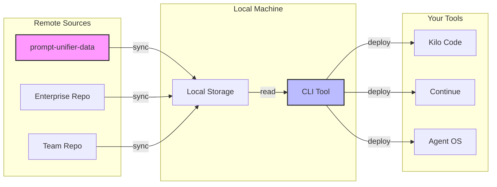

# Prompt Unifier

<div align="center" markdown="1">

:material-robot:{ style="font-size: 8em; color: #009688;" }

**The Missing Link Between Your Team's Prompts and Your IDE**

[](https://gitlab.com/waewoo/prompt-unifier/-/pipelines)
[](https://www.python.org/)
[](license.md)

<a href="getting-started.md" class="md-button md-button--primary">🚀 Getting Started</a>
<a href="https://gitlab.com/waewoo/prompt-unifier-data" class="md-button md-button--secondary">📂
Browse Prompts</a>

</div>

______________________________________________________________________

## Why Prompt Unifier?

<div class="grid cards" markdown>

- ## :material-sync: **Sync Everywhere**

  Centralize prompts in Git and sync them to **Kilo Code**, **Continue**, and other AI tools
  instantly.

- ## :material-check-decagram: **Quality Control**

  Stop "broken prompt" updates. Enforce strict YAML formatting and metadata validation before
  deployment.

- ## :material-lock: **Secure by Design**

  Built-in secret scanning prevents API keys from leaking into your prompt repositories.

- ## :material-account-group: **Team Standard**

  Share the exact same "Senior Architect" prompt across your entire engineering team.

</div>

## How It Works



## 🌟 Feature Spotlight: The Official Catalog

Don't start from scratch! We maintain a curated collection of high-quality, validated prompts ready
for use.

<div class="admonition quote" markdown="1">
<p class="admonition-title">Connect to the Source</p>
**[prompt-unifier-data](https://gitlab.com/waewoo/prompt-unifier-data)** is our official "battery-included" repository.
It contains standard prompts for:

- :snake: Python Development (Unit Tests, Docstrings, Refactoring)
- :whale: DevOps (Dockerfile optimization, CI/CD pipelines)
- :memo: Documentation (Technical writing, Release notes)

```bash
# One command to get them all
prompt-unifier sync --repo https://gitlab.com/waewoo/prompt-unifier-data.git
```

</div>

## Quick Start

Get up and running in less than a minute.

```bash
# 1. Install via pip
pip install prompt-unifier

# 2. Initialize your local environment
prompt-unifier init

# 3. Sync with the official catalog
prompt-unifier sync --repo https://gitlab.com/waewoo/prompt-unifier-data.git

# 4. Deploy to your tools (e.g., Kilo Code, Continue)
prompt-unifier deploy
```

## Resources & Presentations

Need to convince your team? Use these slides to present the Prompt Unifier vision.

<div class="grid cards" markdown>

- ## :flag_us: **English Slides**

  <a href="assets/pdf/prompt-unifier-presentation-en.pdf" class="md-button md-button--primary md-button--full">Download
  PDF</a>

- ## :flag_fr: **Slides Français**

  <a href="assets/pdf/prompt-unifier-presentation-fr.pdf" class="md-button md-button--primary md-button--full">Télécharger
  PDF</a>

</div>

[](license.md)
