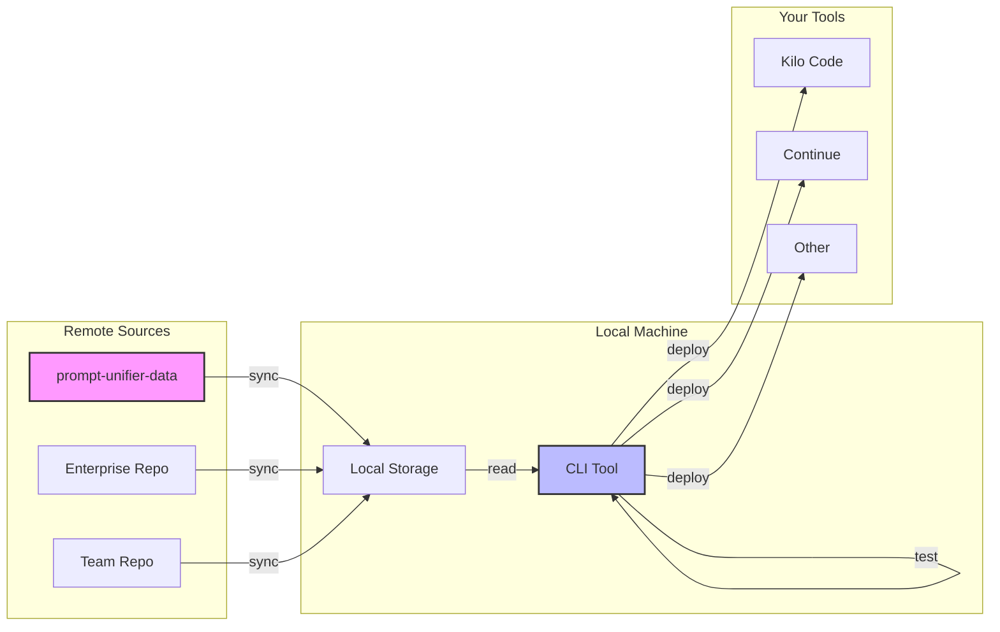

# Basic Usage

This section covers the standard workflow for using Prompt Unifier in your daily tasks.

## The Standard Workflow

The typical lifecycle of a prompt in Prompt Unifier involves four main steps:

1. **Sync**: Pull the latest changes from the central Git repository.
1. **List**: Explore available prompts.
1. **Test**: Run functional tests to verify prompt behavior with AI.
1. **Deploy**: Generate configurations for your local AI tools.



## Essential Commands

### Syncing Prompts

The `sync` command is the bridge between your team's shared repository and your local machine.

```bash
prompt-unifier sync
```

!!! tip "Auto-Sync" You can add this to your shell's startup script (like `.bashrc` or `.zshrc`) to
ensure you always have the latest prompts when you start your terminal.

### Listing Prompts

Use the `list` command to see what's available. It displays metadata like the prompt name,
description, and compatible tools.

```bash
prompt-unifier list
```

**Output Example:**

```text
Name            Description                     Tools
--------------  ------------------------------  -----------------
bug-report      Standard bug reporting format   kilo, continue
code-review     Senior engineer code review     continue
doc-string      Python docstring generator      kilo
```

### Testing Prompts

Before deploying, you can run functional tests to ensure your prompts produce the expected output
using actual AI models.

```bash
prompt-unifier test prompts/my-prompt.md
```

See [Functional Testing](functional-testing.md) for more details on setup and test file creation.

### Deploying Prompts

The `deploy` command takes the prompts from your local storage and installs them into the specific
configuration directories of your tools.

```bash
prompt-unifier deploy
```

By default, this attempts to deploy to **all** enabled tools found in your configuration.

## Best Practices

- **Don't edit deployed files directly**: Any changes made to the files inside your tool's config
  (e.g., `~/.continue/prompts`) will be overwritten the next time you run `deploy`. Always edit the
  source in the Git repository.
- **Test before deploying**: Use the `test` command to verify that your prompts work as expected
  with actual LLMs.
- **Validate before committing**: If you contribute to the prompt repository, run
  `prompt-unifier validate` (or `validate --type skills` for skills only) before pushing to ensure
  files meet the schema requirements.
- **Skills require Kilo Code**: Skills are only deployed by the `kilocode` handler. Use
  `prompt-unifier deploy --handlers kilocode` (or the default all-handlers deploy) to include them.
  Running `deploy --handlers continue` will show skills as `SKIPPED` — this is expected.
